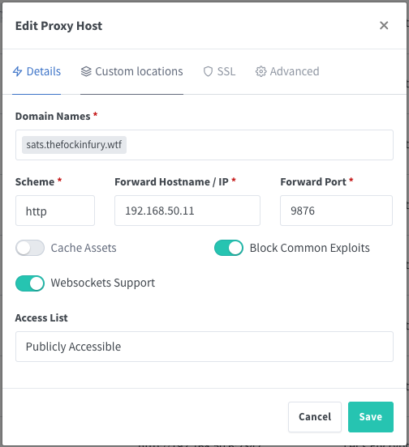
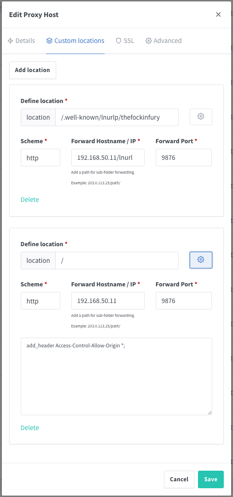
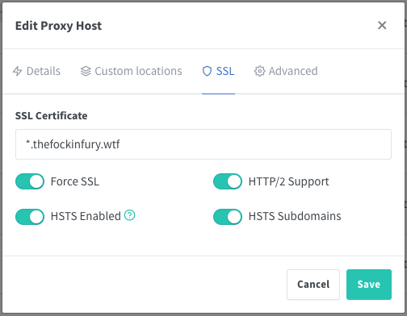

# Non-Custodial Zaps with Core Lightning
A guide for configuring your Core Lightning node to accept non-custodial zaps on Nostr.

## Background

Nostr is an exciting decentralized social media (and more!) protocol that affords users self-sovereignty over their data. It's also tightly integrated with Bitcoin's Lightning Network, enabling users to "zap" each other small amounts of bitcoin for posts, ideas, and dank memes.

There are several ways to do this custodially, placing trust over your lightning transactions into a third party's hands. [Lightning Tip Bot](https://t.me/LightningTipBot) and [Wallet of Satoshi](https://www.walletofsatoshi.com/) are two major players in the space.

If you prefer to send and receive zaps without needing to trust a third party, things get more complicated. Many options are still in development. But if you happen to be running a Core Lightning node, there's already a great solution for you to use!

## Prerequisites

- Some comfort with linux, the command line, networking, and configs. This was pretty easy for me to achieve after casually messing around with Linux and self-hosting for a few months.
- A Core Lightning node, obviously! The [Raspibolt guide](https://raspibolt.org/guide/bonus/lightning/cln.html) for Core Lightning was fantastic and very easy to follow.
- A domain name that you own
- A reverse proxy to shuttle requests from the internet over to your CLN node, **with the ability to handle SSL termination** (SSL is important here). I use Nginx Proxy Manager.
- Two different Nostr public/private key pairs (aka "accounts") -- one to use as your social media account and the other to use exclusively for signing zaps.

## Steps

This guide assumes that you already own a domain, that you have your reverse proxy up and running to point requests from the Internet over to your server, and that you have a Lightning node with Bitcoin and Core Lightning installed.

### Security

The guide below requires you to expose a port over Clearnet which does increase your attack surface and may pose privacy or security challenges if not done carefully. Consider doing the following before moving forward:

- If you absolutely must open a port on your home router, consider using a DNS service like Cloudflare when following this guide. Cloudflare allows you to proxy your connections so that your home IP is at least not exposed directly in DNS entries.
- Rather than exposing a port on your home router, consider setting up a [Cloudflare Zero Trust tunnel](https://omar2cloud.github.io/cloudflare/cloudflared/cloudflare/) instead.
- The self-hosting purist may instead prefer to remove all reliance on third parties along your request path. You can rent a cheap virtual private server through providers like Linode or Digital Ocean, then set up your own VPN tunnel between that server and your home network. A setup like this has the added benefit of allowing you to operate your node over Clearnet without exposing your private IP address; the only IP that gets exposed is the IP of your virtual server in the cloud. Here is an [excellent guide](https://github.com/TrezorHannes/Dual-LND-Wireguard-VPS) for how to set that up. It's written for an LND node but is easy to translate the required config changes to CLN.

### Getting Ready

1.  First, you'll need to install Rust as that will be required to build the Core Lightning plugins we're going to add. As per the installation guide [here](https://www.rust-lang.org/learn/get-started), run the following as your admin user on your Lightning node:
    
    `curl --proto '=https' --tlsv1.2 -sSf https://sh.rustup.rs | sh`
    
2.  Next, create a Nostr private and public key using any Nostr client (Damus, Iris, Snort, etc.). Convert the public key (npub) to hex using [this tool](https://damus.io/key/). Leave the private key (nsec) as-is; you don't need to convert it. Save both for later.
    
3.  If you're using a firewall on your Lightning node, you'll need to open port 9876 on that machine so that one of the plugins we'll be installing later can communicate with the outside world. If using UFW, you should do:
    `sudo ufw allow 9876 comment 'allow CLN URL plugin'`
    

### Build and Configure the Plugins

You need to install two CLN plugins that will work together: [CLN-Zapper](https://github.com/thesimplekid/cln-zapper-rs) and [CLNURL](https://github.com/elsirion/clnurl).

#### Install CLNURL

As the admin user on your Lightning node, from your home directory: 

1.  Clone the repository: `git clone https://github.com/elsirion/clnurl`
2.  Copy the cloned repo to a directory where you store your downloaded CLN plugins. If you followed the Raspibolt guide to set up your CLN node, the location would be something like: `cp -r ~/clnurl/ /data/lightningd-plugins-available/`
3.  Now, cd to that new location: `cd /data/lightningd-plugins-available/clnurl`
4.  Build the plugin: `cargo build -r` and grab a coffee. This will take a few minutes.
5.  After the build is complete, the plugin file will be located in a subdirectory: `./target/release/clnurl`
6.  Open your CLN config and add the following to the bottom:

```
# clnurl-plugin
plugin=/data/lightningd-plugins-available/clnurl/target/release/clnurl
clnurl_base_address=[The domain or subdomain that you want to receive zaps, i.e. https://sats.thefockinfury.wtf]
clnurl_listen=0.0.0.0:9876
clnurl_description=[Think of something witty to put here. Users will see this on the invoice when they zap you.]
clnurl_nostr_pubkey=[The hex-encoded public key of the Nostr identity you set up earlier]
```

7.  Now save your config and exit, then restart the CLN service.

#### Install CLN-Zapper

_Note: you don't need to install CLN-Zapper in order to use LNURLs and user-friendly Lightning addresses with Core Lightning, but you do need to install it if you want those things to work with Zaps on Nostr. You can break here and skip down to the Networking and Testing sections if you want to make sure that just the previous step is working as intended._

These steps are very similar to the ones you just followed to install CLNURL. As the admin user on your node, return to your home directory. Then:

1.  Clone the repository: `git clone https://github.com/thesimplekid/cln-zapper-rs`
2.  Copy the cloned repo to a directory where you store your downloaded CLN plugins. If you followed the Raspibolt guide to set up your CLN node, the location would be something like: `cp -r ~/cln-zapper-rs-0.2.2/ /data/lightningd-plugins-available/`
3.  Now, cd to that new location: `cd /data/lightningd-plugins-available/cln-zapper-rs-0.2.2`
4.  Build the plugin: `cargo build -r`. Time for another coffee!
5.  After the build is complete, the plugin file will be located in a subdirectory: `./target/release/cln-zapper`
6.  Open your CLN config and add the following to the bottom:

```
# cln-zapper-plugin
plugin=/data/lightningd-plugins-available/cln-zapper-rs-0.2.2/target/release/cln-zapper
clnzapper_nostr_nsec=[The Nostr private key (nsec) you created earlier]
clnzapper_nostr_relay=wss://relay.damus.io
```

You can use whatever Nostr relay you like on that last line; the plugin will attempt to broadcast each zap to all the relays that the user who zaps you includes in the request. Consider this more of a fallback.

7.  Save your config and exit.

It's almost time to get zapping!

### Networking

You'll need to establish a path from the internet to the open port on the CLN URL plugin. **Remember: you must use SSL.**

The steps below use Nginx Proxy Manager but any reverse proxy will do. The [CLN URL repo](https://github.com/elsirion/clnurl) has more information about reverse proxy configuration using Nginx.

1.  Use your chosen DNS provider to point your domain name or a subdomain to the IP address where CLN URL can be accessed.
2.  Set up your reverse proxy. As I use Nginx Proxy Manager, here is my configuration:

| Step	| Description	| Image	|
| -----	| -----		| -----	|
| 1	| Establish the route between your domain and the host:port |  |
| 2	| Add two custom locations so that you can zap your lightning address as well as an LNURL. Replace 'thefockinfury' with whatever user name you like--probably the one you use on Nostr? Or, something like "tips" or "zaps." You can add as many of these as you like. _Note: adding the 'Access-Control-Allow-Origin' header here helps with certain nostr clients on the Web._ |  |
| 3	| Set up SSL	|  |

_Note: Step 2.2 above is optional, but allows you to use a user-friendly lightning address, such as "tips@sats.thefockinfury.wtf," instead of a lengthy LNURL in your Nostr profile._

### Nostr Client Setup

It's time to put your new zappable lightning address into your Nostr client of choice!

1. If you set up the custom locations in your reverse proxy (step 2.2 in the previous section), you can simply plug your Lightning address (e.g. "zaps@sats.thefockinfury.wtf") into your Nostr client.

_--OR--_

If you prefer not to set up the custom locations in your reverse proxy (step 2.2 in the previous section), you can still encode your domain as an LNURL to use for zaps.

1.  Encode your domain name as an LNURL using [this tool](https://lnurl.fiatjaf.com/codec/). I used 'sats.thefockinfury.wtf' as my domain name. Therefore, I would input 'sats.thefockinfury.wtf/lnurl' into the encoder.
2.  Take the resulting LNRUL and set that as your lightning address in your Nostr client.

You should be done!

### Testing it Out

If your networking setup works properly, you should be able to curl your new setup: `curl -L <your domain>/.well-known/lnurlp/<your username>`

The response should look something like:

```html
{"minSendable":100,"maxSendable":100000000000,"metadata":"[["text/plain","Zap!"]]","callback":"sats.thefockinfury.wtf/invoice","tag":"payRequest","allowsNostr":true,"nostrPubkey":"a76dc09a8c2437c08d918d0896c6a10cc22a5ea74339a0925175dadce1c9508f"}
```

After that, try receiving some zaps! **Note:** some clients like Damus don't let you zap yourself, so you might need another Nostr identity to do this. If everything is working, you should see the following in your CLN logs:

```
2023-03-28T15:40:25.218Z INFO    lightningd: Resolved invoice 'dc1bf6e0-7a36-4594-a302-c4610acd7a95' with amount 69000msat in 1 htlcs
2023-03-28T15:40:45.955Z INFO    plugin-cln-zapper: Broadcasted: 948e990a9a21109bb639757bb5dfa0353765da6bc34d4e84700a674c14f6addf
2023-03-28T15:41:11.580Z INFO    lightningd: Resolved invoice 'f6e5497f-bf91-4933-af01-2e9fec032c1d' with amount 500000msat in 1 htlcs
2023-03-28T15:42:38.064Z INFO    plugin-cln-zapper: Broadcasted: e26316651a4662f980159398327b33f6e2d63403ec3dd1b98cce0c7f15171934
```

You can see what's happening behind the scenes: first, your LNURL resolves to your node and creates an invoice which then gets paid. Shortly after, the CLN Zapper plugin broadcasts that event to all of the Nostr relays that the user who zapped you is subscribed to. At that point, the zap should show up on your Nostr client!

Congratulations! You now are not only your own bank, but also your own Nostr zapping service!

## Shout-outs
I knew next to nothing about the inner workings of Lightning, the intricacies of self-hosting and networking just a few months ago. The Lightning community have been incredibly generous with their time. I couldn't have produced this guide without the help of a few folks in particular along the way:

- [Christian Decker](https://github.com/cdecker) for helping me wrap my head around Core Lightning as I was getting set up.
- [Max Kotlan](https://github.com/MaxKotlan) as well as [wiz](https://github.com/wiz) and [nymkappa](https://github.com/nymkappa) who, while helping me host my own instances of [LNVisualizer](https://github.com/MaxKotlan/LN-Visualizer) and [mempool](https://github.com/mempool/mempool), respectively, taught me just about everything I know about how to interact with bitcoin and lightning back ends.
- [thesimplekid](https://github.com/thesimplekid) for not only authoring the CLN-Zapper plugin but also hand-holding me as I fumbled my way through setting it up.

### Tips
The people I linked above did all the actual work here and deserve all the credit and tips you can muster! But if you have some sats left over after all of that and would like to throw some my way, you can do so here:

| Format	| Value |
| ---	| ---	|
| QR 	| 	|
| Address	| tips@sats.thefockinfury.wtf	|
| LNURL	| lnurl1dp68gurn8ghj7umpw3ejuargv4nx7cmtd9hxvatj0yh8warx9uh8wetvdskkkmn0wahz7mrww4excup0w35x2en0vd4kjmnxw4e8jreusva	|

### Contact
Find me on Nostr! npub15akupx5vysmuprv335yfd34ppnpz5h48gvu6pyj3whddecwf2z8s9vds8f
